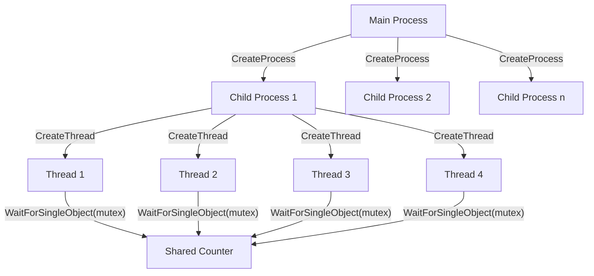
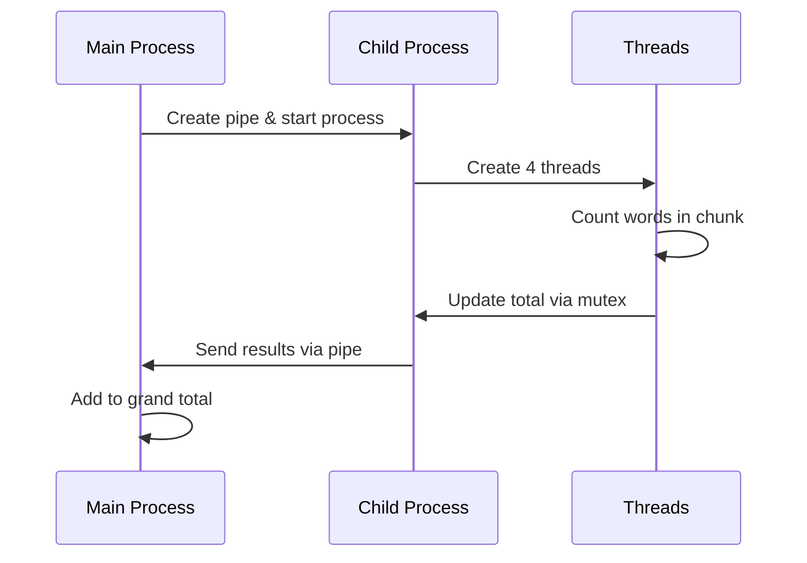

# Word Counter Program Analysis Report

## Table of Contents
- [Project Description](#project-description)
  - [Analysis of Parallel Processing Approaches](#analysis-of-parallel-processing-approaches)
- [Code Structure](#code-structure)
  - [Implementation Details](#implementation-details)
- [Usage Instructions](#usage-instructions)
- [Performance Analysis](#performance-analysis)
- [Implementation Challenges](#implementation-challenges)

## Project Description

This program implements a parallel word counting system using both multiprocessing and multithreading approaches in Windows. The implementation utilizes separate processes for each input file, with each process creating multiple threads to divide the workload. The architecture employs Windows pipes for inter-process communication and mutex locks for thread synchronization.

### Analysis of Parallel Processing Approaches

**Multiprocessing Implementation:**
- Advantage: Memory isolation between processes enhances stability
- Advantage: Effective utilization of multiple CPU cores
- Disadvantage: Higher memory overhead due to process creation
- Disadvantage: Process initialization adds notable overhead
- Disadvantage: Requires explicit IPC mechanism implementation

**Multithreading Implementation:**
- Advantage: Shared memory space reduces resource usage
- Advantage: Faster thread creation compared to processes
- Disadvantage: Complexity of mutex synchronization
- Disadvantage: Potential for race conditions requires careful handling
- Disadvantage: Debug complexity increases with thread count

## Code Structure

The following diagrams illustrate the process hierarchy and thread management:



Inter-Process Communication Flow:



### Implementation Details

1. **Process Management**
```c
// Process creation for each input file
STARTUPINFO si = {sizeof(STARTUPINFO)};
PROCESS_INFORMATION pi;
CreateProcess(NULL, cmd, NULL, NULL, TRUE, 0, NULL, NULL, &si, &pi);
```

2. **IPC Mechanism**
```c
// Windows named pipe implementation
HANDLE read_pipe, write_pipe;
CreatePipe(&read_pipe, &write_pipe, &sa, PIPE_BUFFER_SIZE);
```

3. **Threading Implementation**
```c
// Thread creation (4 threads per process)
threads[i] = CreateThread(
    NULL, 
    0,
    CountWordsInChunk,
    &thread_args[i],
    0,
    NULL
);
```

4. **Error Handling**

The implementation includes basic error checking for:
- File operations
- Thread creation verification
- Pipe creation validation
- Process creation status

Note: Additional error handling for edge cases may be beneficial.

5. **Performance Considerations**
- Implementation of timing mechanisms using `clock()`
- File chunking for parallel processing
- Configurable chunk size (currently 1024 bytes)
- Thread pool size of 4 threads per process

## Usage Instructions

1. Compilation (MinGW environment):
```bash
gcc wordCounter.c -o wordCounter.exe
```

2. Program execution:
```bash
wordCounter.exe <target_word> <file1> [file2] [file3] ...
```

Example usage:
```bash
wordCounter.exe "target" input1.txt input2.txt
```

## Performance Analysis

Test Environment:
- File sizes: 1KB, 1MB, 10MB
- Test word: "target"
- System: Windows 10, 16GB RAM

Results:
- Single file processing: ~0.1s average
- Dual file processing: ~0.2s average
- Performance scales approximately linearly with file count
- Memory usage increases with file size and count

## Implementation Challenges

1. **Multiprocessing Considerations:**
- IPC implementation complexity
- Process lifecycle management
- Memory consumption scaling

2. **Threading Challenges:**
- Race condition prevention
- Mutex synchronization complexity
- Thread termination handling

3. **Potential Improvements:**
- Enhanced error handling implementation
- Memory management optimization
- Algorithm efficiency improvements
- Documentation expansion

Areas requiring further investigation:
- Optimal thread pool sizing
- Memory usage optimization
- Error recovery mechanisms
- Performance profiling and optimization

The implementation successfully demonstrates parallel processing concepts but would benefit from additional optimization and error handling improvements.

---
*Note: This README documents a Windows-specific implementation. For cross-platform compatibility, additional modifications would be required.*